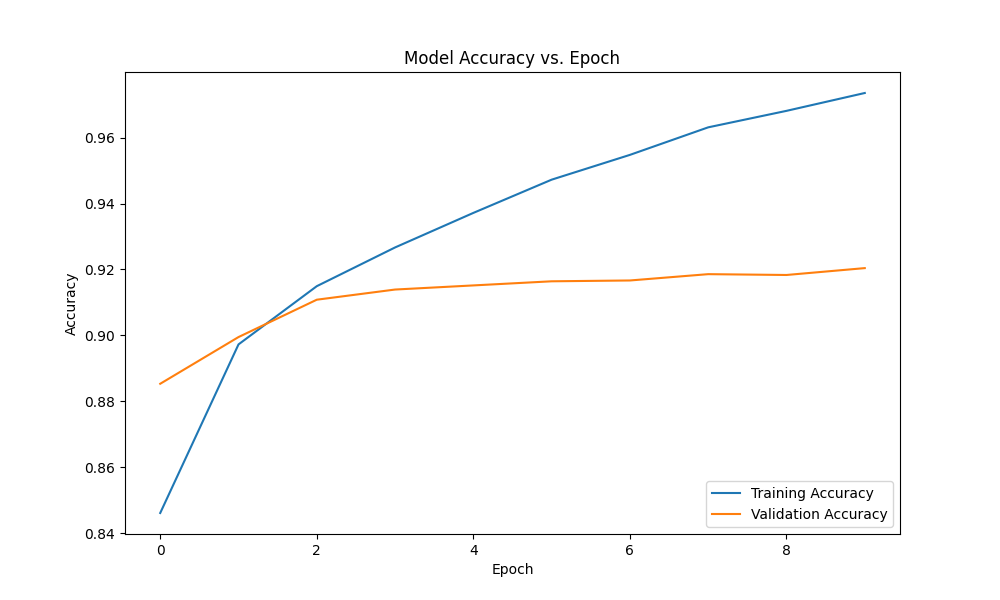
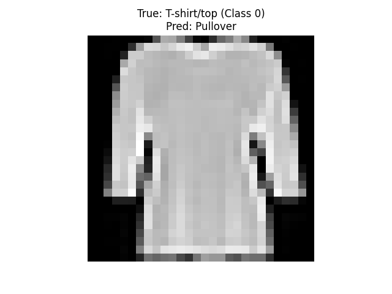
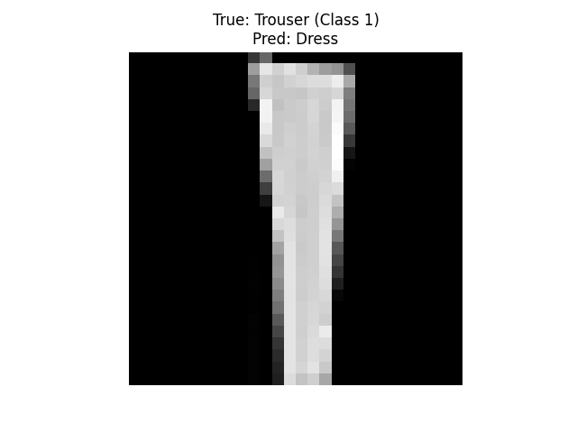
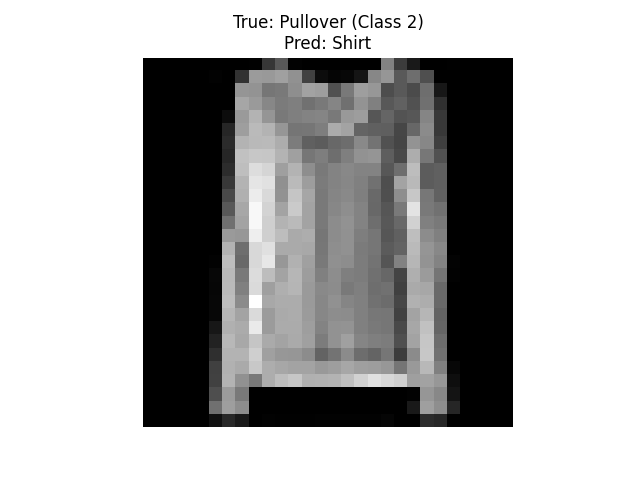
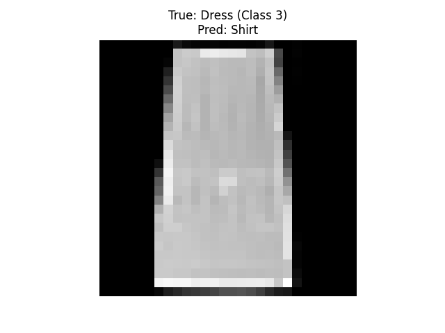
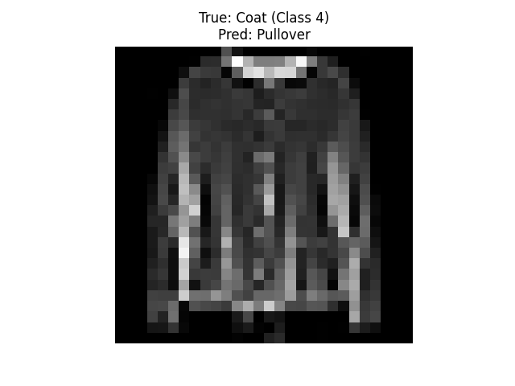
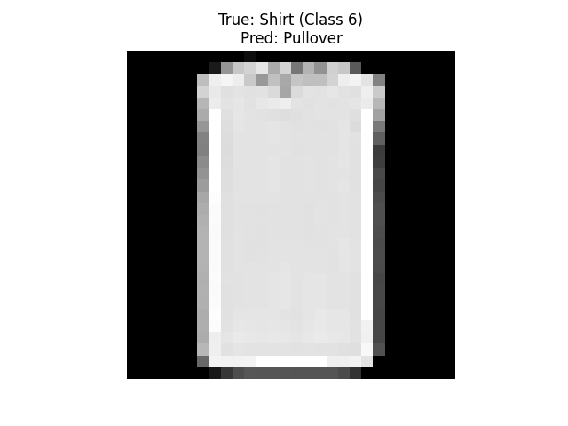
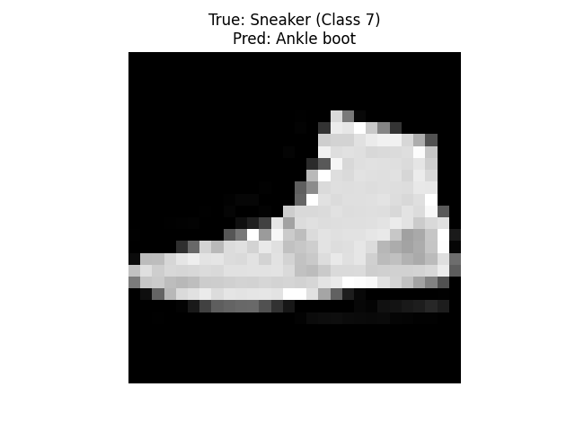
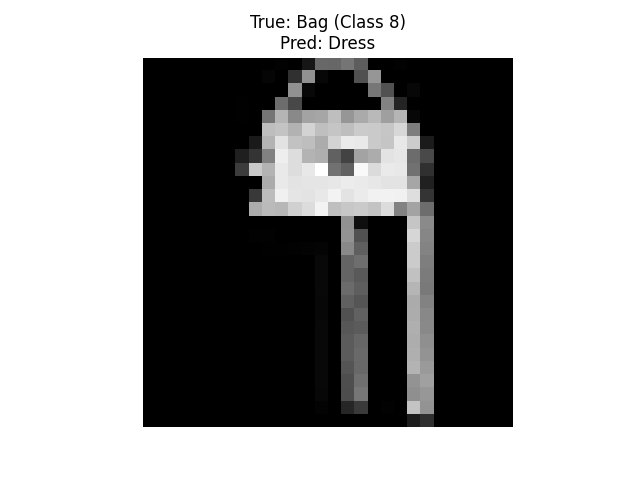
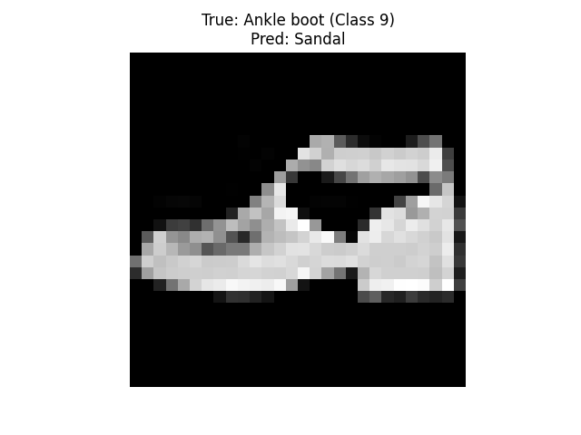

# Assignment: CNN Image Classifier

### Model Summary

<pre style="white-space:pre;overflow-x:auto;line-height:normal;font-family:Menlo,'DejaVu Sans Mono',consolas,'Courier New',monospace">┏━━━━━━━━━━━━━━━━━━━━━━━━━━━━━━━━━┳━━━━━━━━━━━━━━━━━━━━━━━━┳━━━━━━━━━━━━━━━┓
┃ Layer (type)                    ┃ Output Shape           ┃       Param # ┃
┡━━━━━━━━━━━━━━━━━━━━━━━━━━━━━━━━━╇━━━━━━━━━━━━━━━━━━━━━━━━╇━━━━━━━━━━━━━━━┩
│ conv2d (Conv2D)                 │ (None, 26, 26, 28)     │           280 │
├─────────────────────────────────┼────────────────────────┼───────────────┤
│ max_pooling2d (MaxPooling2D)    │ (None, 13, 13, 28)     │             0 │
├─────────────────────────────────┼────────────────────────┼───────────────┤
│ conv2d_1 (Conv2D)               │ (None, 11, 11, 56)     │        14,168 │
├─────────────────────────────────┼────────────────────────┼───────────────┤
│ flatten (Flatten)               │ (None, 6776)           │             0 │
├─────────────────────────────────┼────────────────────────┼───────────────┤
│ dense (Dense)                   │ (None, 56)             │       379,512 │
├─────────────────────────────────┼────────────────────────┼───────────────┤
│ dense_1 (Dense)                 │ (None, 10)             │           570 │
└─────────────────────────────────┴────────────────────────┴───────────────┘
</pre>

The total number of trainable parameters is **394,530**.

--------------------------------------------------------

### Training and Validation Accuracy Graph

Epoch 1/10 - accuracy: 0.8381 - loss: 0.4533 - val_accuracy: 0.8784 - val_loss: 0.3404

Epoch 2/10 - accuracy: 0.8931 - loss: 0.2972 - val_accuracy: 0.8975 - val_loss: 0.2837

Epoch 3/10 - accuracy: 0.9084 - loss: 0.2482 - val_accuracy: 0.9053 - val_loss: 0.2580

Epoch 4/10 - accuracy: 0.9204 - loss: 0.2160 - val_accuracy: 0.9130 - val_loss: 0.2430

Epoch 5/10 - accuracy: 0.9319 - loss: 0.1860 - val_accuracy: 0.9158 - val_loss: 0.2317

Epoch 6/10 - accuracy: 0.9404 - loss: 0.1610 - val_accuracy: 0.9152 - val_loss: 0.2320

Epoch 7/10 - accuracy: 0.9501 - loss: 0.1369 - val_accuracy: 0.9143 - val_loss: 0.2491

Epoch 8/10 - accuracy: 0.9572 - loss: 0.1157 - val_accuracy: 0.9174 - val_loss: 0.2509

Epoch 9/10 - accuracy: 0.9647 - loss: 0.0972 - val_accuracy: 0.9130 - val_loss: 0.2708

Epoch 10/10 - accuracy: 0.9688 - loss: 0.0842 - val_accuracy: 0.9111 - val_loss: 0.2939

- After the second epoch, validation accuracy makes little progress while training accuracy continues to increase.

----------------------------

Test Accuracy: 0.9152

----------------------------

### Misclassified Examples:

Comments: 
- The model is overfitting, because it continues to train for higher training accuracy, while validation accuracy does not make significant progress. 

- The test accuracy is similar to the validation accuracy of 0.9158.

- From looking at the misclassified examples, the model is good at categorizing items into general categories (e.g. shoe), but has a hard time categorizing them into specific ones (e.g. sandals, boots, sneakers, etc.). 

    - In misclassified example 5, a sandal was misclassified as a sneaker.
    - In example 7, a sneaker was misclassified as an ankle boot.